魚拓元記事: https://funatsufumiya.hatenablog.com/entry/2025/07/20/164420

# JIS下駄配列の入力効率を測ってみる＜１＞ 〜 Keyboard Layout Analyzerと人力変換による計測

[JIS下駄配列](https://github.com/funatsufumiya/jis_geta)を作ってみたはいいものの、客観的指標がなければ良い配列なのかどうかもよくわからない。

【追記】後から思い出したけど、[eswai/keyboard_analyzer](https://github.com/eswai/keyboard_analyzer)を使えばよかったかもしれない。この存在がどうしても思い出せなくて、この記事では以下に記載の方法をとったが、またこれを使った方法もいつか試してみたい。（★ → [次記事](https://funatsufumiya.hatenablog.com/entry/2025/07/21/130110)で実際にやってみました。）

## 目次

<!-- [:contents] -->

- [目次](#目次)
- [測定方法](#測定方法)
- [計測](#計測)
  - [◆ 入力1:「おはようございます。今日の調子はいかがですか？」](#-入力1おはようございます今日の調子はいかがですか)
  - [◆ 結果1](#-結果1)
  - [◆ 入力2:「少々お待ち下さい。ありがとうございます。」](#-入力2少々お待ち下さいありがとうございます)
  - [◆ 結果2](#-結果2)
  - [◆ 入力3:「入力効率を測る対決をしてみる」](#-入力3入力効率を測る対決をしてみる)
  - [◆ 結果3](#-結果3)
- [結果まとめ](#結果まとめ)
  - [スコア](#スコア)
  - [単打率](#単打率)
- [分析・考察](#分析考察)

## 測定方法

自分が人間逆変換器になって、入力された日本語をJIS配列上のアルファベットに直し（例えばQWERTYの場合、「おはよう」→「ohayou」）、[Keyboard Layout Analyzer](https://patorjk.com/keyboard-layout-analyzer)に定義した[JIS配列のアルファベットキーボード](https://gist.github.com/funatsufumiya/8562dcbb8d468812dfe4febab87f8fe8)での**スコア**と**ヒートマップ**を確認してみることにする。

また、参考として**単打率**も計算する。単打の基準は1モーラが単打で打てているかどうかとし、「きょ」などの拗音も今回は1モーラとしてカウントする。（例えば "a" や "4" などを純粋な単打とし、"<" などShiftが要るもの、"di" などの複数同時打鍵は単打としない。）

人力変換を使った実験なので、短い文章しか測定できないのはあしからず。

ちなみに表示されたアルファベットを実際にJISのQWERTYで打ってみれば、なんとなく難しさと偏りは体感できるかもしれない。

（なお、現時点でのJIS下駄のバージョンはv1.1.4。）

## 計測

### ◆ 入力1:「おはようございます。今日の調子はいかがですか？」

- JIS（かな入力）: 
    - `6 f 9 4 b@ x@ e j r > g) 4 k a) 4 d f e t t@ w@ r t ?`
    - (`6f94b@x@ejr>g)4ka)4dfett@w@rt?`)
- JIS下駄:
    - `6 f 9 j bk xk e 4 r > go j k ao j d f e t tk wk r t ?`
    - (`6f9jbkxke4r>gojkaojdfettkwkrt?`)
- 新下駄: 
    - `dl e di j qk xl k x z . fi j a gi j l e k d o , z d jn`
    - (`dledijqkxlkxz.fijagijlekdo,zdjn`)

### ◆ 結果1

- JIS: スコア 22.65、単打率 16/24 = 0.67

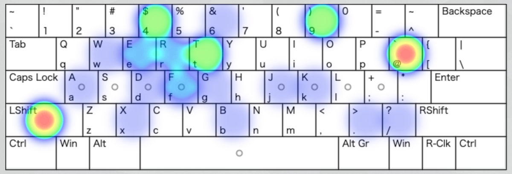

- JIS下駄: スコア 42.90、単打率 16/24 = 0.67

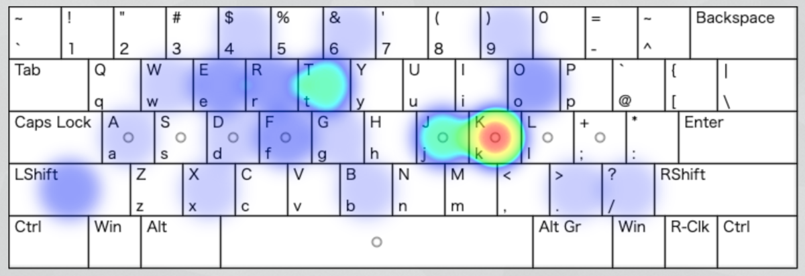

- 新下駄: スコア 57.03、単打率 17/24 = 0.70

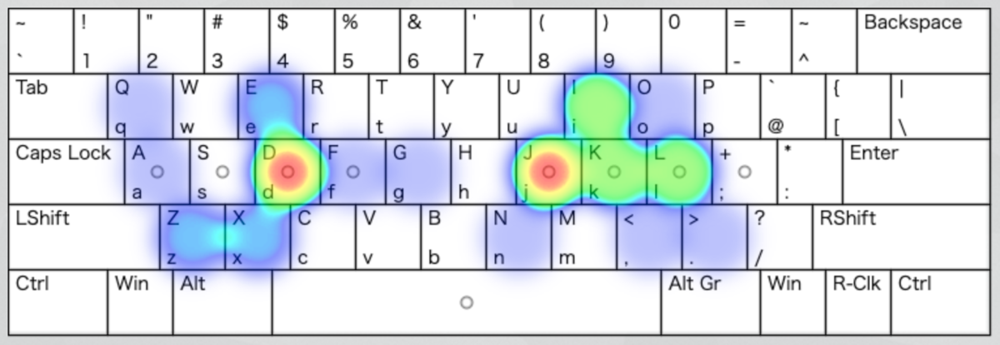

### ◆ 入力2:「少々お待ち下さい。ありがとうございます。」

- JIS（かな入力）: 
    - `d) 4 d) 4 6 j a h q@ x e > 3 l t@ s 4 b@ x@ e j r >`
    - (`d)4d)46jahq@xe>3lt@s4b@x@ejr>`)
- JIS下駄:
    - `do j do j 6 4 a h qk x e > 3 l tk s j bk xk e 4 r >`
    - (`dojdoj64ahqkxe>3ltksjbkxke4r>`)
- 新下駄: 
    - `ei j ei j dl x t h sm sl k . dj fl o s j wk xl k x z .`
    - (`eijeijdlxthsmslk.djflosjwkxlkxz.`)

### ◆ 結果2

- JIS: スコア 31.72、単打率 15/23 = 0.65

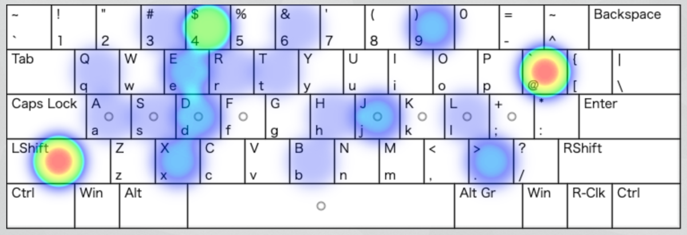

- JIS下駄: スコア 45.87、単打率 15/23 = 0.65

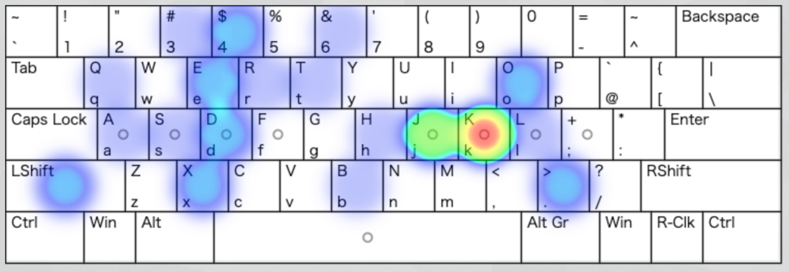

- 新下駄: スコア 63.02、単打率 14/23 = 0.61

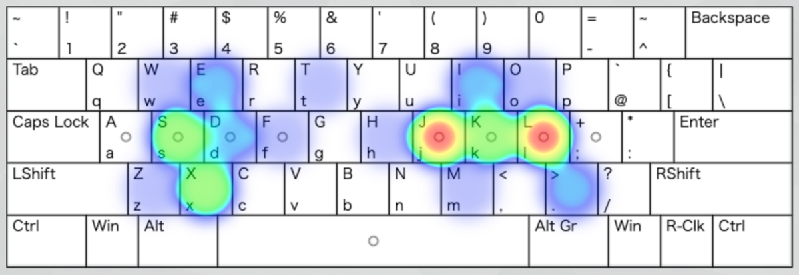

### ◆ 入力3:「入力効率を測る対決をしてみる」

**※ 「を」を計測するために、0のシフト面を「≈（U+2248、Almost Equal To）」と仮に定義して計測。**

- JIS（かな入力）: 
    - `i( 4 l) h b 4 l z ≈ f t . q e : z ≈ d w n .`
    - (`i(4l)hb4lz≈ft.qe:z≈dwn.`)
- JIS下駄:
    - `ei j rl h b j l @ d0 f t . q e : @ d0 d w n .`
    - (`eijrlhbjl@d0ft.qe:@d0dwn.`)
- 新下駄: 
    - `to j ao h i j fl b al e d v m k el b al l n od v`
    - (`tojaohijflbaledvmkelballnodv`)

### ◆ 結果3

- JIS: スコア 23.30、単打率 17/21 = 0.81

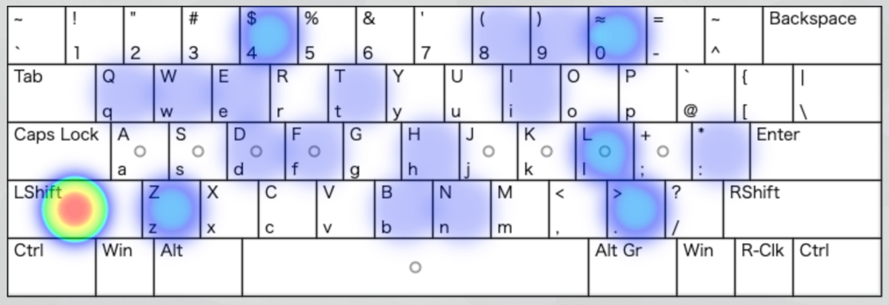

- JIS下駄: スコア 39.41、単打率 17/21 = 0.81

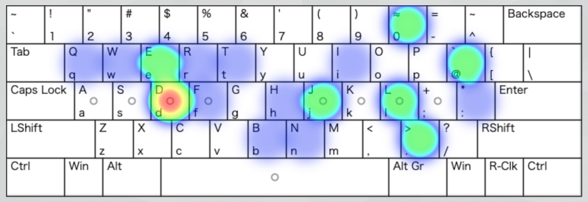

- 新下駄: スコア 51.45、単打率 14/21 = 0.67

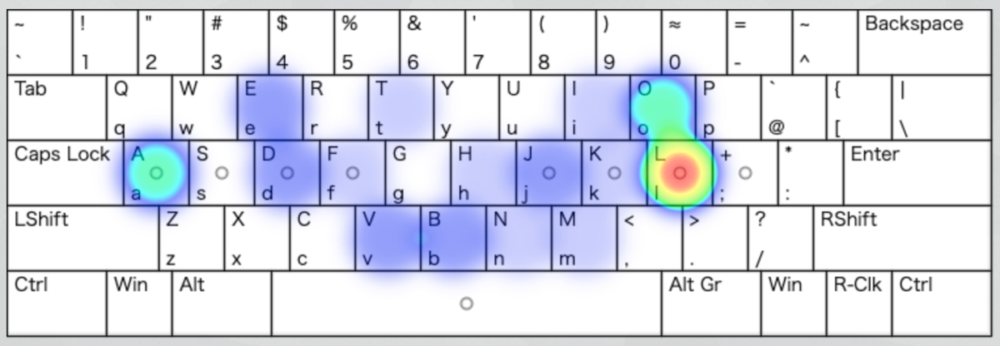

## 結果まとめ

### スコア

| |計測1|計測2|計測3|
|-|-|-|-|
|JIS|22.65|31.72|23.30|
|JIS下駄|42.90|45.87|39.41|
|新下駄|57.03|63.02|51.45|

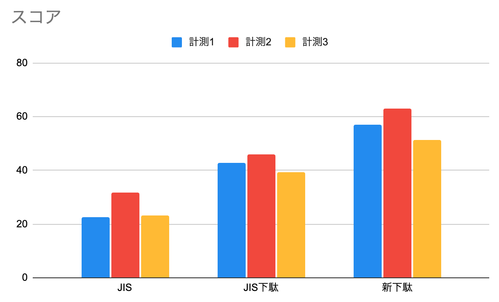

### 単打率

| |計測1|計測2|計測3|
|-|-|-|-|
|JIS|0.67|0.65|0.81|
|JIS下駄|0.67|0.65|0.81|
|新下駄|0.70|0.61|0.67|

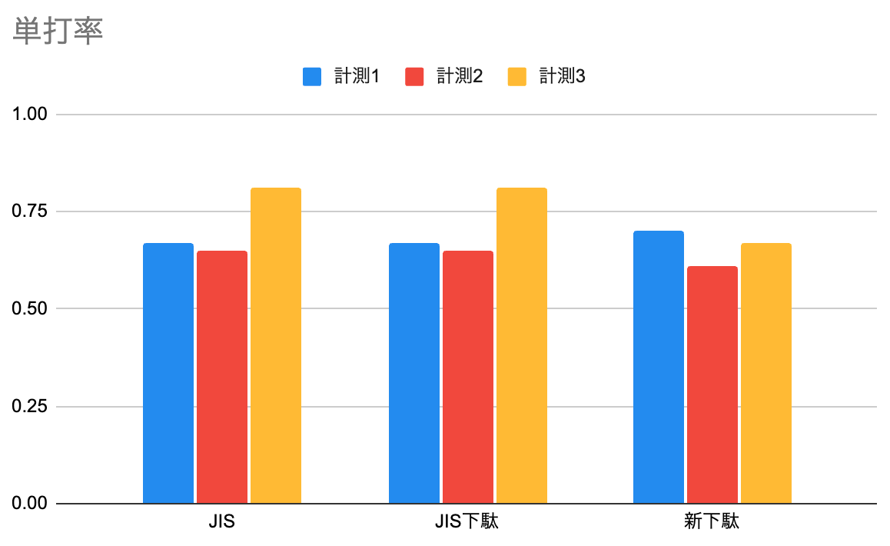

## 分析・考察

まず、人力変換によるものなので、選定した文章によって結果が変動することは念頭に置いておきたい。今回、拗音が比較的多く含まれていることには注意が必要。

スコアを線形的に見てよいものか（また効率という言葉が妥当かどうか）迷うのだけれど、**仮に単純に線形的に捉えるなら**、ざっとみて、JIS下駄はJISの1.5〜2倍ほど効率が良く、新下駄はJISの2〜3倍ほど効率が良いという結果とも読み取れる。新下駄はJIS下駄の1.3倍〜1.5倍ほどの効率の良さということになりそうだ。[^1]

単打率については、今回句読点を含めたことも一応影響して、あまり差がないという結果になった。（JISがShiftも含めたときに思ったより単打ではないという見方もできるし、新下駄の単打率が高いという見方もできる。）

この結果を果たしてどう考えるのか、そしてKeyboard Layout Analyzerの指標をどう捉えるかがかなり難しいところなのだけれど、配列を覚えるのが大変な新下駄配列でこれは当然の結果だとみるのか、何も覚えていなくても打てるJISは健闘しているとみるのか（そして打鍵最適化をどう捉えるか）、JIS下駄はJISから改善していると考えるか否か。

**最後の考察については、自分はノーコメントということにしておきたい**。というのも、Keyboard Layout Analyzerでスコアがたいてい低く出るQWERTYについて、事実として自分は日々常用していて（自分の利用している複数の配列のなかで事実として）最も打鍵効率が良いし、他の配列で簡単に代替できるものだと思えない。（もちろん実用や結果は一旦置いておいたときに、複数の配列を使っていて、スコアと比例する効率の良さを体験できる瞬間も素朴にあるのは確か。）

ただ少なくともいえるのは、新下駄配列のJIS配列アルファベットに変換した結果は、**パッと見でも打ちやすそうなアルファベットになっていて**、時々記号が出てくるJISやJIS下駄に比べれば、誰もが打ちやすそうだなと感じるんじゃないだろうか。[^2]

あとはこれと同時打鍵をどう評価するか次第だけれど、自分は同時シフトと非同時シフト（前置・後置シフト）を比較できる指標を持っていないし、比較したところで「指がしゃべる」配列としての価値が失われたりと比較の意味を現時点であんまり感じないので、そのあたりは後学に任せたいと思う。

最後にJIS下駄について、こうしたデータを今後も総合しつつ、今回の計測からは読み取ることのできない、記憶の負荷や、ホームポジションによらない打鍵最適化、直感性などをどう評価するかが、JIS下駄を評価するポイントとなると思う。例えば、直感的でJISに近いながらも、まぁまぁの打鍵効率を持っていると評価するか、否か。（そして橋渡しとしての役割をどう評価するか。）

[^1]: このスコア、本来このような比較に使う指標ではない（本来は文章ごとの比較ではなく、配列ごとの比較）ので、指標の使い方の妥当性は若干懐疑的ではあるが、例えば記号だけをいくつか入れてみたり、アルファベットだけを入れてみたときのスコアを比較すると、一応直感に即した結果は出ているのかなという気はする。

[^2]: 打ちやすそうに見えるアルファベットについて言及したものの、これが中指シフトなどで同時打鍵するということになると、急に打ちづらいストロークが熟練度や人によっては登場してしまうのが、同時打鍵や中指・薬指シフトの評価の難しいところ。（ただし、これは同時打鍵等でなくてもありえる可能性もある。ただこれを比較研究したデータというのがないので自分はわからない。）