魚拓元記事: https://funatsufumiya.hatenablog.com/entry/2025/07/21/130110

# JIS下駄配列の入力効率を測ってみる＜2＞ 〜 日本語キー配列アナライザーの利用

## 目次

<!-- [:contents] -->

- [目次](#目次)
- [（先に「まとめ」の内容を転記）](#先にまとめの内容を転記)
- [日本語キー配列アナライザーのフォーク](#日本語キー配列アナライザーのフォーク)
- [分析方法](#分析方法)
- [◆ 計測1: まずはデフォルト文章](#-計測1-まずはデフォルト文章)
  - [JISかな](#jisかな)
  - [JIS下駄](#jis下駄)
- [◆ 計測1の分析](#-計測1の分析)
- [◆ 計測2: 不思議の国のアリス](#-計測2-不思議の国のアリス)
  - [JISかな](#jisかな-1)
  - [JIS下駄](#jis下駄-1)
- [◆ 計測2の分析](#-計測2の分析)
- [◆ 計測3: Wikipedia - 血小板](#-計測3-wikipedia---血小板)
  - [JISかな](#jisかな-2)
  - [JIS下駄](#jis下駄-2)
- [◆ 計測3の分析](#-計測3の分析)
- [まとめ](#まとめ)


## （先に「まとめ」の内容を転記）

※ とてもデータ量の多い記事になってしまったので、先にまとめに書いている箇条書きをこちらにも転機しておきます。

- JISかなに比べて、JIS下駄は最上段の利用頻度は下がっている。
- JISかなが中心部以外に偏りがたまに見られる一方、JIS下駄はより中心寄りになっている。
- Shiftと@の利用頻度が下がっている代わりに、K = 中指シフトの利用頻度が高い。
    - 今回句読点などにShiftを利用する設定をしたが、中指シフトを使う選択をした場合はより偏重傾向がある可能性。
- 打つ文章によっては、最上段の利用頻度が上がることがある。特に「え/お/や」などの打ちづらいキーもあるが、高頻度というほどではないものの、ここで好みが分かれる可能性。
- 偏りは解消されているが、設計思想の時点でそうであるように、キーボード全体を満遍なく使う傾向。

## 日本語キー配列アナライザーのフォーク

[前の記事](https://github.com/funatsufumiya/jisgeta_research_archive/blob/main/1.md)で[JIS下駄](https://github.com/funatsufumiya/jis_geta)の入力効率を客観的に測るテストをしたとき、[eswai/keyboard_analyzer](https://github.com/eswai/keyboard_analyzer)（日本語キー配列アナライザー）を使えばよかったという追記をした。

で、早速フォークして対応させてみた。

https://github.com/funatsufumiya/keyboard_analyzer_jisgeta

実際使うには、もちろん[元サイト](https://keyboard-analyzer.vercel.app/)では「JIS下駄」を選ぶことはできないので、本来は手元で`git clone`して`npm install`して`npm run dev`するなどが必要だけど、以下に**ブラウザだけで試せるサイト**（GitHub Pages）を準備した。

https://funatsufumiya.github.io/keyboard_analyzer_jisgeta_static/

余談だけれど、「この日本語の文章ってこの配列ではどうやって打つんだろう？」って思ったときなんかに便利で、こういうツールに一つ一つ対応しておくと何かと便利なのかもしれない。

## 分析方法

[今回のツール](https://github.com/funatsufumiya/keyboard_analyzer_jisgeta)は、いわゆる「[Keyboard Layout Analyzer](https://patorjk.com/keyboard-layout-analyzer/)」のように「スコア」みたいなわかりやすい指標を出してくれるわけではなくて、数々の客観指標の中から自分で分析させるスタイルをとっている。

よって、とりあえずすごく長い文章から出る傾向を比較して、都度それらを比較して分析してみようと思う。

※ なお、キー打鍵列については、そのまま掲載するとなぜか "はてな記法" により一部省略されてしまうので、作為的に改行した。

※ 記号定義について、新下駄配列由来の特殊なバインド（FG = `「」左` など）が正しく計測されないという問題をはらんでいるため、各分析で都度言及するが、少し工夫をしている。

## ◆ 計測1: まずはデフォルト文章

入力文章:

>人類が増えすぎた人口を宇宙に移民させるようになって、既に半世紀が過ぎていた。地球の周りの巨大な人工都市は人類の第二の故郷となり、人々はそこで子を産み、育て、そして死んでいった。

### JISかな

キー打鍵列:

```
d@y.et@25rg@qd@yb4<shift>04a<shift>84ienyxp.94iu<shift>zw<shift>,
rw@ifypegt@rg@weq<shift>.
ag<shift>84kj0lkg<shift>9q@eud@yb4sdfd@y.ekq@eikbg<shift>94sul<shift>,
vsv@sfcbw@b<shift>04n<shift>,
cq@w<shift>,cdwdyw@e<shift>zq<shift>.
```

ヒートマップ・グラフ等:

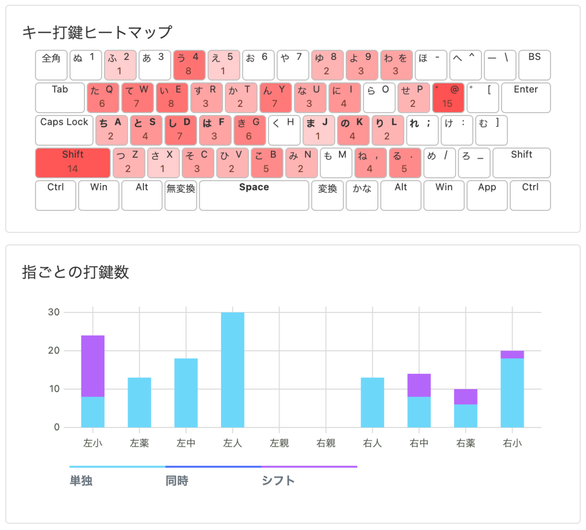

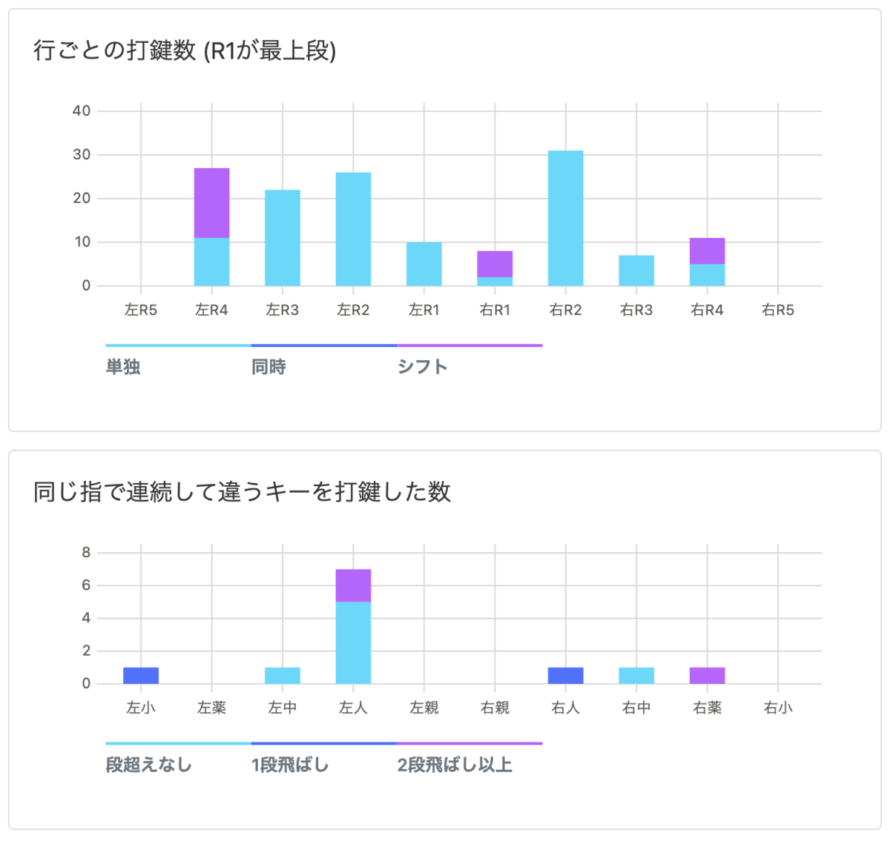


### JIS下駄

キー打鍵列:
```
<k>dy.e<k>t25r<k>zq<k>dybj<d>0j<i>ajienyxp.9jiugw<shift>,
r<k>wifypez<k>tr<k>zweq<shift>.
a<i>gjk40lk<o>g<k>qeu<k>dybjsdf<k>dy.ek<k>qeikb<o>gjsul<shift>,
vs<k>vsfcb<k>wb<d>0jn<shift>,c<k>qw<shift>,cdwdy<k>wegq<shift>.
```

ヒートマップ・グラフ等:

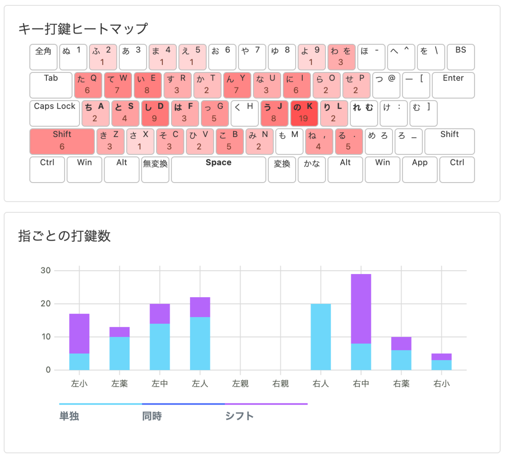

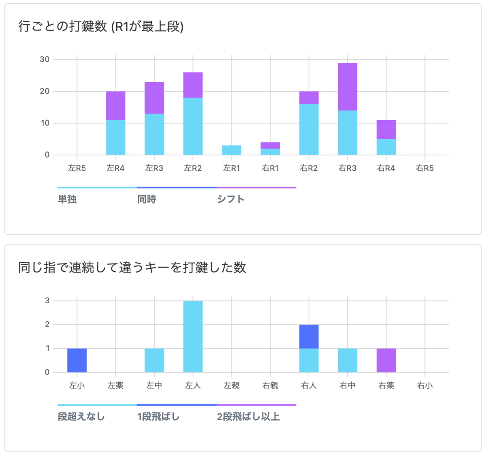

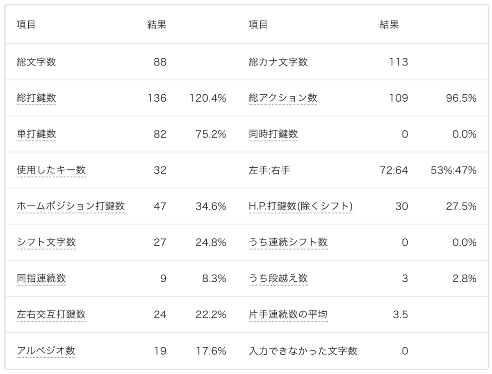

## ◆ 計測1の分析

明らかに**最上段の数字列、＠（濁点）、Shiftの利用率が減っている**。そして **K（中指シフト）の利用率が増えている**。

これはJIS下駄では拗音レイヤーを定義したことにより、拗音入力に最上段を使わなくなったため。また、「う」を4キーの位置からJキーの位置に移動させたことが影響している。

中指シフトについては、**右中指のシフト率が急上昇している**ことからも明らか。これは元のJISかなで「@（濁点）」に当たる部分が全て中指シフトに置き換えられていることを物語っている。

また、単打鍵率が89.1%から75.2%に低下しているが、[前回の記事](https://github.com/funatsufumiya/jisgeta_research_archive/blob/main/1.md)では単打率の定義をモーラを基準にしていたため、この測定方式では単打鍵率の定義が異なっていることに注意。

グラフを見ていると、左Shiftの利用率が減った割には左小指の利用率はさほど減っていない印象で、用途としてはシフトとなっているが、キー打鍵列を見てもShiftキー以外は一見何シフトに割かれているかよくわからないので、この後の計測でも一応注意して見ていきたい。

<div align="center">◆・◆・◆</div>
<div align="center">◆・◆・◆</div>

## ◆ 計測2: 不思議の国のアリス

入力文章 (756文字): 
>アリスは川辺でおねえさんのよこにすわって、なんにもすることがないのでとても退屈（たいくつ）しはじめていました。一、二回はおねえさんの読んでいる本をのぞいてみたけれど、そこには絵も会話もないのです。「絵や会話のない本なんて、なんの役にもたたないじゃないの」とアリスは思いました。
>
>そこでアリスは、頭のなかで、ひなぎくのくさりをつくったら楽しいだろうけれど、起きあがってひなぎくをつむのもめんどくさいし、どうしようかと考えていました（といっても、昼間で暑いし、とってもねむくて頭もまわらなかったので、これもたいへんだったのですが）。そこへいきなり、ピンクの目をした白うさぎが近くを走ってきたのです。それだけなら、そんなにめずらしいことでもありませんでした。さらにアリスとしては、そのうさぎが「どうしよう！　どうしよう！　ちこくしちゃうぞ！」とつぶやくのを聞いたときも、それがそんなにへんてこだとは思いませんでした（あとから考えてみたら、これも不思議に思うべきだったのですけれど、でもこのときには、それがごく自然なことに思えたのです）。でもそのうさぎがほんとうに、チョッキのポケットから懐中時計（かいちゅうどけい）をとりだしてそれをながめ、そしてまたあわててかけだしたとき、アリスもとびあがりました。
>
>というのも、チョッキのポケットなんかがあるうさぎはこれまで見たことがないし、そこからとりだす時計をもっているうさぎなんかも見たことないぞ、というのに急に気がついたからです。そこで、興味（きょうみ）しんしんになったアリスは、うさぎのあとを追っかけて野原をよこぎって、それがしげみの下の、おっきなうさぎの穴にとびこむのを、ぎりぎりのところで見つけました。次のしゅんかんに、アリスもそのあとを追っかけてとびこみました。

### JISかな

※ キー打鍵列はそのまま掲載しているが、長過ぎるものははてな記法により...と変わり、抜粋されている。

キー打鍵列:

```
3lrft0^@w@6,5xyk9bir0<shift>zw<shift>,uyimr.bst@uekw@swmqehz<shift>8qehz<shift>9dfd@/wejdq<shift>.ea<shift>,itef6,5xyk9yw@e.-y<shift>0kc@ewnq:;s@<shift>,cbif5mte0muekw@r<shift>.[57te0kue-yuyw<shift>,uyk7himqqued@<shift>7uek]s3lrf6mejdq<shift>.enterentercbw@3lrf<shift>,3qjkutw@<shift>,vug@hkhxl<shift>0zh<shift>zqoqkdeq@_4:;s@<shift>,6g3t@<shift>zwvug@h<shift>0z]km/ys@hxed<shift>,s@4d94tstyt@5wejdq<shift>8se<shift>zwm<shift>,v.jw@3zed<shift>,s<shift>zwm,]hw3qjmj0out<shift>zqkw@<shift>,b;mqe^yq@<shift>zqkw@rt@<shift>9<shift>.cb^egul<shift>,v[yhk/<shift>0dqfh4xg@t@ath<shift>0fd<shift>zwgqkw@r<shift>.c;q@:uo<shift>,cyui/r@odebsw@m3ljpyw@dq<shift>.xoi3lrsdwf<shift>,ck4xg@t@[s@4d94<shift>1spaces@4d94<shift>1spaceabhda<shift>74c@<shift>1]sz2@7hk<shift>0geqsgm<shift>,c;t@cyui^ywbq@sf6mejpyw@dq<shift>83stotyt@5wnqo<shift>,b;m2dg@i6m4^@gq@<shift>zqkw@r:;s@<shift>,w@mbksgif<shift>,c;t@b@hdp@yubsi6m5qkw@r<shift>9<shift>.w@mck4xg@t@-ys4i<shift>,a<shift>9<shift>zgk-[:<shift>zstotea<shift>84s@:e<shift>8tea<shift>84s@:e<shift>9<shift>0slq@dwc;<shift>0ut@/<shift>,cdwjq30wwt:q@dqsg<shift>,3lrmsv@3t@ljdq<shift>.enterenterse4km<shift>,a<shift>9<shift>zgk-[:<shift>zsuytt@3.4xg@fb;jw@nqbst@ued<shift>,cbtoslq@rs:e<shift>0m<shift>zwe.4xg@uytmnqbsuec@<shift>,se4kig<shift>84igt@zeqtow@r<shift>.cbw@<shift>,g<shift>94n<shift>8g<shift>94n<shift>9dydyiu<shift>zq3lrf<shift>,4xg@k3s<shift>06<shift>zt:wkfo<shift>09bg@<shift>zw<shift>,c;t@d:@nkdqk<shift>,6<shift>zgu4xg@k3uisv@b]k<shift>0<shift>,g@lg@lksb_w@nz:jdq<shift>.zg@kd<shift>8ytyi<shift>,3lrmck3s<shift>06<shift>zt:wsv@bnjdq<shift>.
```

ヒートマップ・グラフ等:

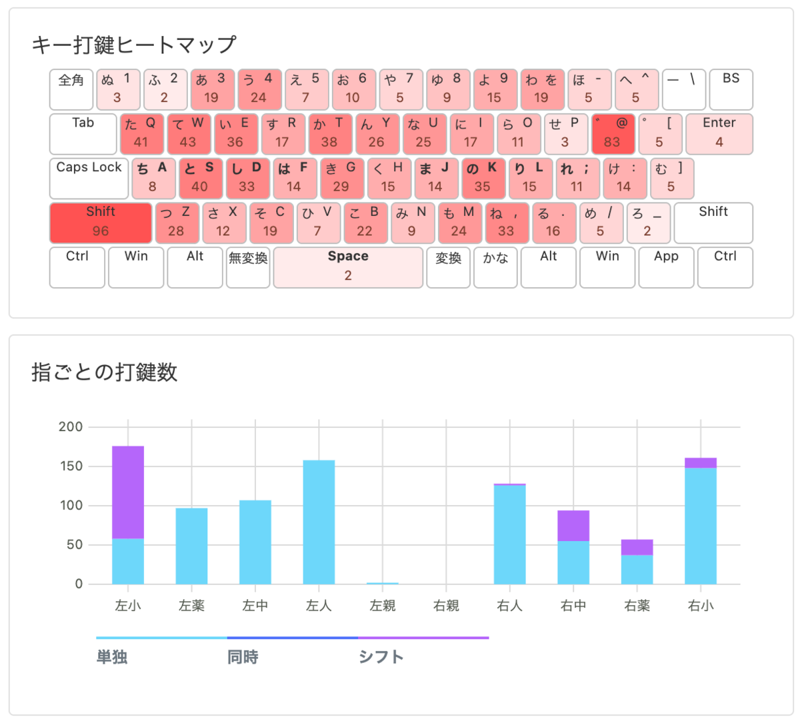

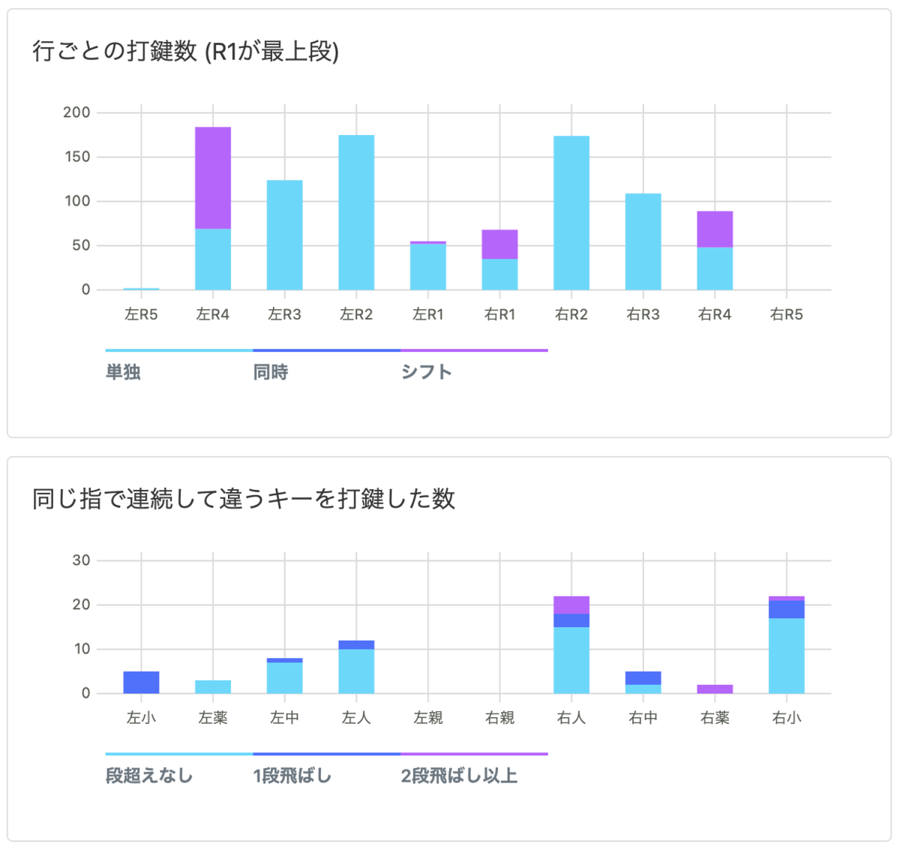

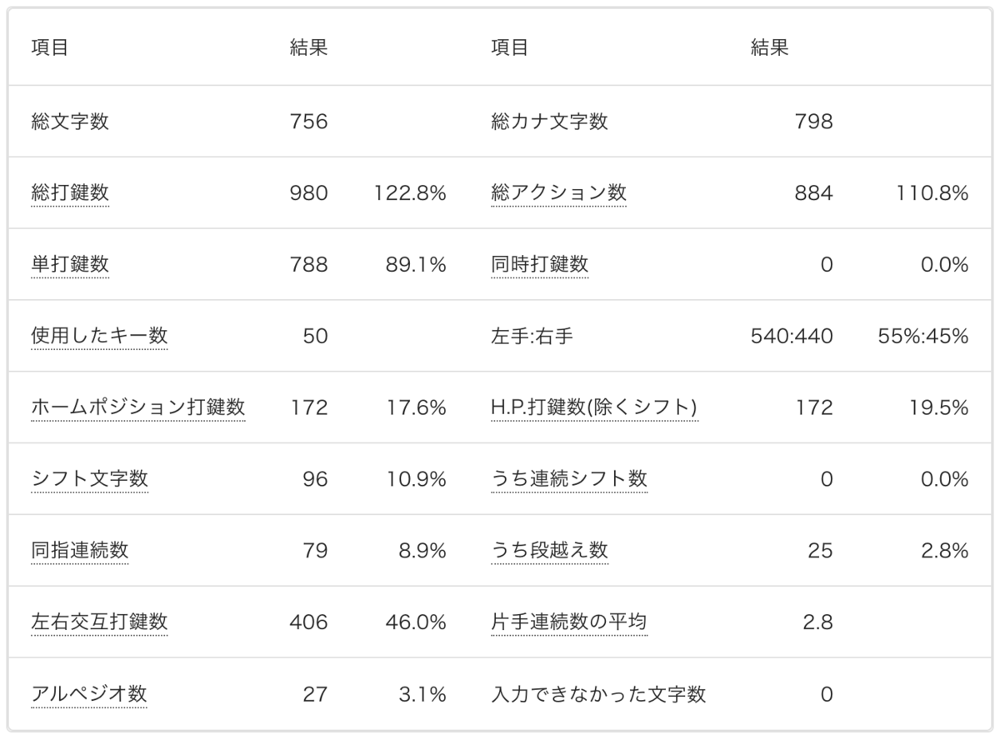

### JIS下駄

キー打鍵列:
```
3lrft0<d>^<k>w6,5xyk9bir0gw<shift>,uyimr.bs<k>tuek<k>wswmqeh@<j>hqeh@df<k>d/we4dq<shift>.ea<shift>,itef6,5xyk9y<k>we.-y<d>0k<k>cewnq:;<k>s<shift>,cbif5mte0muek<k>wr<shift>.<g>f57te0kue-yuyw<shift>,uyk7himqque<u>cueks3lrf6me4dq<shift>.enterentercb<k>w3lrf<shift>,3q4kut<k>w<shift>,vu<k>zhkhxl<d>0@hgqoqkde<k>q_j:;<k>s<shift>,6z3<k>tgwvu<k>zh<d>0@]km/y<k>shxed<shift>,<k>sjd9jtsty<k>t5we4dq<j>hsegwm<shift>,v.4<k>w3@ed<shift>,sgwm,]hw3q4m40outgqk<k>w<shift>,b;mqe^y<k>qgqk<k>wr<k>t<shift>.cb^ezul<shift>,<l>vyhk/<d>0dqfhjx<k>z<k>tath<d>0fdgwzqk<k>wr<shift>.c;<k>q:uo<shift>,cyui/<k>rodebs<k>wm3l4py<k>wdq<shift>.xoi3lrsdwf<shift>,ckjx<k>z<k>t<g>f<k>sjd9j<shift>1space<k>sjd9j<shift>1spaceabhd<u>aj<k>c<shift>1s@<k>27hk<d>0zeqszm<shift>,c;<k>tcyui^ywb<k>qsf6me4py<k>wdq<j>h3stoty<k>t5wnqo<shift>,b;m2d<k>zi6mj<d>^z<k>qgqk<k>wr:;<k>s<shift>,<k>wmbkszif<shift>,c;<k>t<k>bhd<d>pyubsi6m5qk<k>wr<shift>.<k>wmckjx<k>z<k>t-ysji<shift>,<o>agzk<l>-:gstote<i>aj<k>s:e<j>hte<i>aj<k>s:e<d>0sl<k>qdwc;<d>0u<k>t/<shift>,cdw4q30wwt:<k>qdqsz<shift>,3lrms<k>v3<k>tl4dq<shift>.enterentersejkm<shift>,<o>agzk<l>-:gsuyt<k>t3.jx<k>zfb;4<k>wnqbs<k>tued<shift>,cbtosl<k>qrs:e<d>0mgwe.jx<k>zuytmnqbsue<k>c<shift>,sejki<i>gjiz<k>t@eqto<k>wr<shift>.cb<k>w<shift>,<o>gjn<j>h<o>gjndydyiugq3lrf<shift>,jx<k>zk3s<d>06gt:wkfo<d>09b<k>zgw<shift>,c;<k>td<d>:nkdqk<shift>,6gzujx<k>zk3uis<k>vb]k<d>0<shift>,<k>zl<k>zlksb_<k>wn@:4dq<shift>.@<k>zk<i>dytyi<shift>,3lrmck3s<d>06gt:ws<k>vbn4dq<shift>.
```

ヒートマップ・グラフ等:

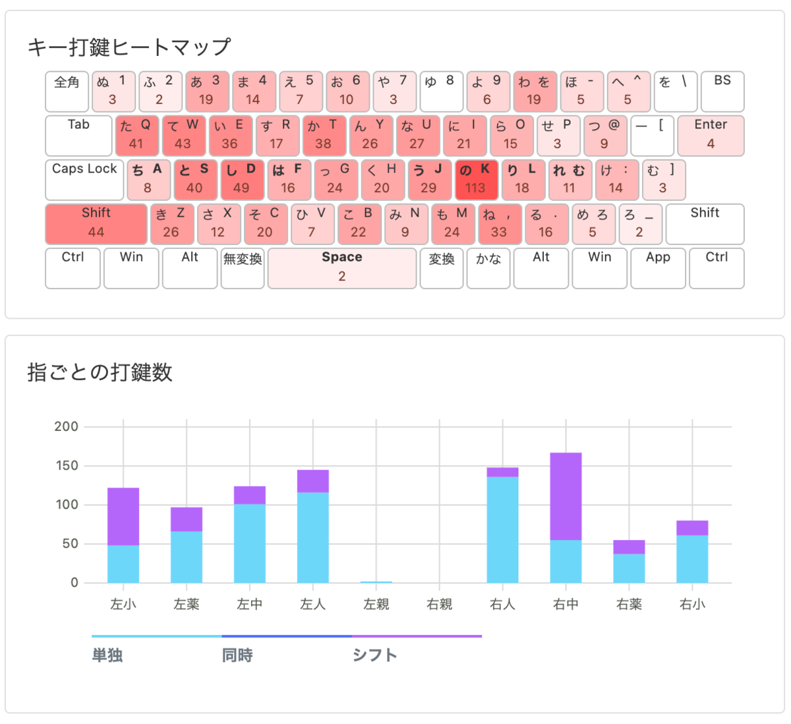

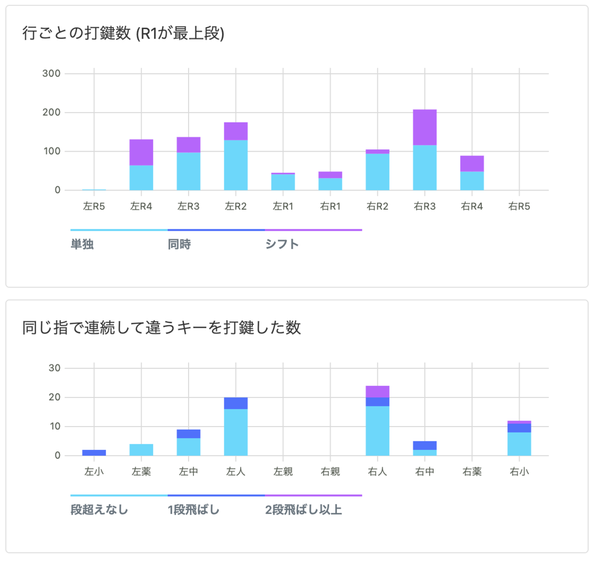

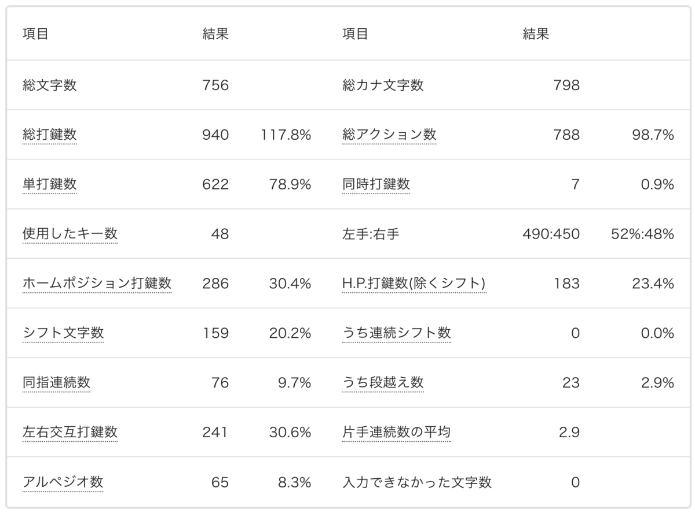

## ◆ 計測2の分析

まず、記号入力については、当初、新下駄配列由来のキーバインドを正しく正確に設定していたため、計測結果に偏りが出ていた。（FG = `「」左`などが反映されず、無理のある記号入力が採用される現象。）

そこで、FG = `「」左` など、**実際のストロークが正しく打たれるように、定義を少しだけ工夫している**。（詳しくは[コード](https://github.com/funatsufumiya/keyboard_analyzer_jisgeta)を参照のこと。ただし、「？」や「！」などの句読点系はJIS由来のShiftを使ったキーストロークを優先している。）

全体傾向としては計測1と変わっていないのだけれど、**「あ/ま/わ」の出現率の高さから、最上段は意外とよく利用される**ということがよくわかる。

これは実際にJIS下駄配列やJISかな配列を打っているときの体感と一致していて、JIS配列の好みが分かれるところになると思う。自分は「あ/ま/わ」については打ちにくさを感じないので、大きな問題ではないと思うけれど、例えば「ほ」や「へ」なども含めたとき、手の大きさなど人によって好みが分かれるポイントのはず。

あくまで自分の印象では、「あ/ま/わ」は良いとしても「え/お/や」は自分は入力しづらいなと感じていて、ヒートマップで見るとそれほど多い頻度ではない気はしつつ、**「お」の出現率は比較的高いので、たぶんここで好みが分かれてくる**。

あとは、句読点入力が多いためか、意外とShiftキーがよく使われる印象。（これは中指・薬指シフトを使った方法も**両方提供していながら**、本分析ではJIS定義を優先しているので、ある意味では当然の結果。）

Shiftキー定義を自分が優先して（利用して）いるのは、ヒートマップを見てもわかるように、**K = 中指シフトの偏重傾向が強い**ので、それを緩和する意図もある。

いずれにしても、**元のJISかなが中心部以外に異様に偏りがある傾向は、JIS下駄ではより中心寄りにバランスが補正されている**という印象。

<div align="center">◆・◆・◆</div>
<div align="center">◆・◆・◆</div>

## ◆ 計測3: Wikipedia - 血小板

（先ほど小説を採用したので、今回科学的な文章を採用した。明らかに正しく計測できなそうな「α」や「β」などの記号は置き換えるなどの処理を施している。）

入力文章 (693文字):

>血小板は、血液に含まれる細胞で、赤血球、白血球と並ぶ第三の血球系である。骨髄中の巨核球（巨大核細胞）の細胞質から産生されるため、核を持たない。大きさは約2ナノmであり、赤血球や白血球の細胞よりも小さい。正常状態の血中には15万～40万個/マイクロL程度含まれている。血小板は、何種類かの血液凝固因子を含んでおり、これらは血小板のアルファ顆粒や濃染顆粒内に含まれている。出血などで血管内皮細胞が傷害を受けると、血小板内の細胞骨格系が変化すると同時に、新たに細胞膜上に細胞接着因子の受容体が発現する。これを血小板の活性化と呼ぶ。これらの糖タンパク受容体やその他の接着因子などを介して血小板は血管内皮に接着し、血小板どうしが凝集し傷口を塞いで血栓を形成する。これを一次止血と呼ぶ。その後、ここから各種凝固因子が放出されることによって、血液中にあるフィブリンが凝固し、さらに血小板や赤血球が捕らわれて、強固な止血栓が完成する。これを二次止血と呼ぶ。体外で固まった血小板とフィブリンおよびそれに捕らわれた赤血球の塊が乾燥したものは「かさぶた」と呼ばれる。（凝固・線溶系も参照）
>
>形態は、非活性状態では円盤状の形態であるが、出血などで血管内皮細胞が傷害を受けると活性化し、偽足（あるいは仮足）とよばれるアメーバ状の突起を伸ばして胞体を伸展させ、最終的には扁平状あるいは球状に変化する。さらに内皮細胞への粘着後には、血小板内部の顆粒が細胞骨格の成分の一つであるアクチンフィラメントによって中央にたぐり寄せられ、目玉焼きのような形態となる。（これは顆粒などの細胞小器官が中央部へと集まるからである。）

### JISかな

※ キー打鍵列はそのまま掲載しているが、長過ぎるものははてな記法により...と変わり、抜粋されている。

キー打鍵列:

```
:<shift>zd<shift>94f@yf<shift>,:z5gi2hj;.xe-@4w@<shift>,p<shift>z:<shift>zg<shift>84<shift>,f<shift>z:<shift>zg<shift>84suo2@q@exyk:<shift>zg<shift>84:ew@3.<shift>.bzz@ea<shift>84kthq@j<shift>8g<shift>9q@ethxe-@4<shift>9kxe-@4dztoxyux;.q/<shift>,th<shift>0mque<shift>.66gxf7h2ukmw@3l<shift>,p<shift>z:<shift>zg<shift>847f<shift>z:<shift>zg<shift>84kxe-@49lmaexe<shift>.ped@<shift>94d@<shift>94qekaa<shift>84if15jy<shift>^40jyb/jeh_<shift>lwes@2hj;we.<shift>.:<shift>zd<shift>94f@yf<shift>,uid<shift>8.etk:z5gg@<shift>94beyd<shift>02hyw@6l<shift>,b;of:<shift>zd<shift>94f@yk3.2<shift>3tl<shift>847bc/tl<shift>84uei2hj;we.<shift>.d<shift>8<shift>z:zus@w@:<shift>ztyuevxe-@4t@d<shift>94t@e<shift>04:.s<shift>,:<shift>zd<shift>94f@yuekxe-@4b<shift>zth:et@^ytr.ss@4d@i<shift>,3oqixe-@4jhd@<shift>94ixe-@4p<shift>za<shift>7heydkd@<shift>894qet@fz:@yr.<shift>.b;<shift>0:<shift>zd<shift>94f@ykt<shift>zpets92@<shift>.b;oks4qyf[hd@<shift>894qe7ckqkp<shift>za<shift>7heydus@<shift>0tedw:<shift>zd<shift>94f@yf:<shift>ztyuevip<shift>za<shift>7hd<shift>,:<shift>zd<shift>94f@ys@4dt@g@<shift>94d<shift>84dgr@h@a<shift>02xew@:<shift>zpy<shift>0:eper.<shift>.b;<shift>0ead@d:zs92@<shift>.ckb@<shift>,bbtothd<shift>8g@<shift>94beydt@-4d<shift>8zx;.bsi9<shift>zw<shift>,:z5ga<shift>84i3.2<shift>e2@lyt@g@<shift>94bd<shift>,xoi:<shift>zd<shift>94f@y7p<shift>z:<shift>zg<shift>84t@so0;w<shift>,g<shift>94bud:zpyt@typer.<shift>.b;<shift>0id@d:zs92@<shift>.qet@ew@tqj<shift>zq:<shift>zd<shift>94f@ys2<shift>e2@ly69v@c;iso0;qp<shift>z:<shift>zg<shift>84ktqjlt@tyc4dqmkf[tx2@q]s9f@;.<shift>.<shift>8g@<shift>94b/spacepy:emxyd<shift>94<shift>9enterenter:eqef<shift>,vt<shift>zped@<shift>94qew@f5yf@yd@<shift>94k:eqew@3.t@<shift>,d<shift>8<shift>z:zus@w@:<shift>ztyuevxe-@4t@d<shift>94t@e<shift>04:.st<shift>zpetd<shift>,g@ch<shift>83.eftl3d<shift>9s9f@;.3/\f@d@<shift>94ks<shift>zg<shift>0kf@dwqe<shift>0dywyxp<shift>,xed<shift>84wgif^y^[ed@<shift>943.efg<shift>84d@<shift>94i^ytr.<shift>.xoiuevxe-@4^k,ya<shift>7hb@if<shift>,:<shift>zd<shift>94f@yue2@ktl<shift>84t@xe-@4b<shift>zthkpe2@ykvszw@3.3hay2<shift>eo/ysi9<shift>zwa<shift>8464iqh@l9po;<shift>,/q@j7gk94u:eqesu.<shift>.<shift>8b;ftl<shift>84us@kxe-@4d<shift>94gtyt@a<shift>84642@^s3zj.tow@3.<shift>.<shift>9
```

ヒートマップ・グラフ等:

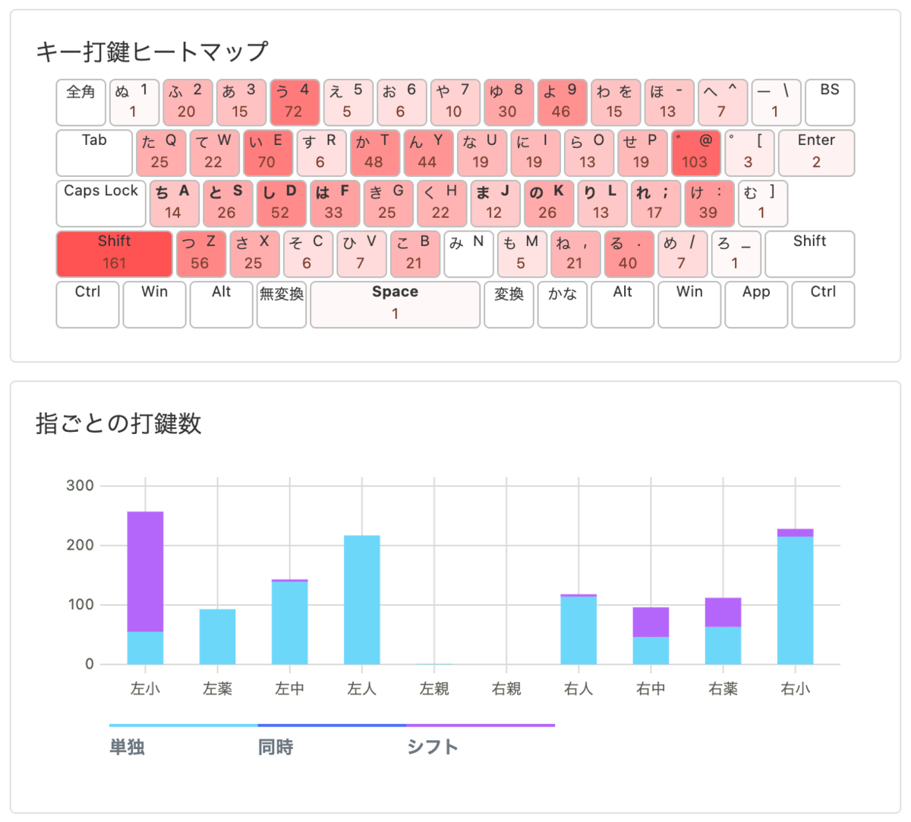

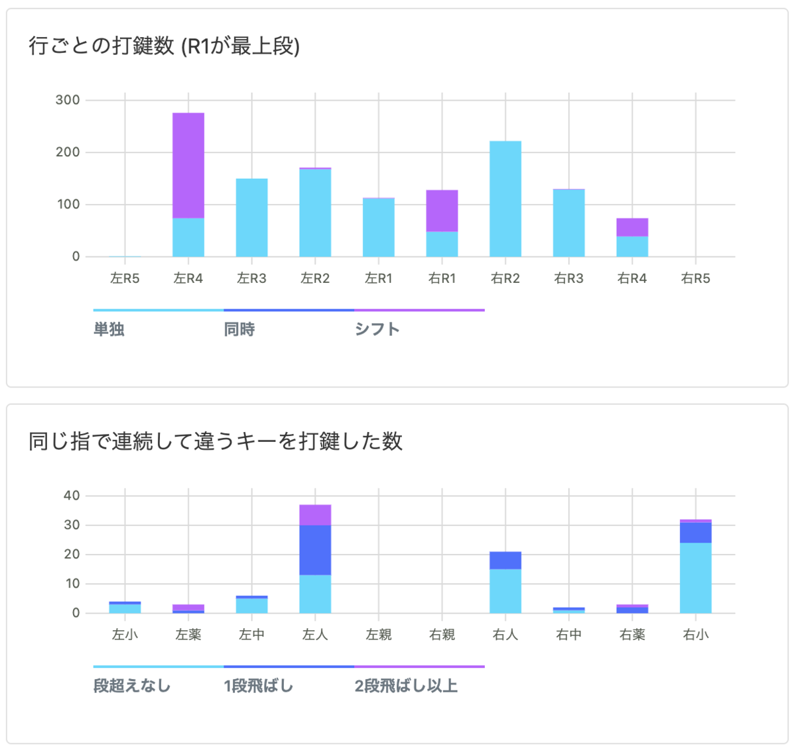

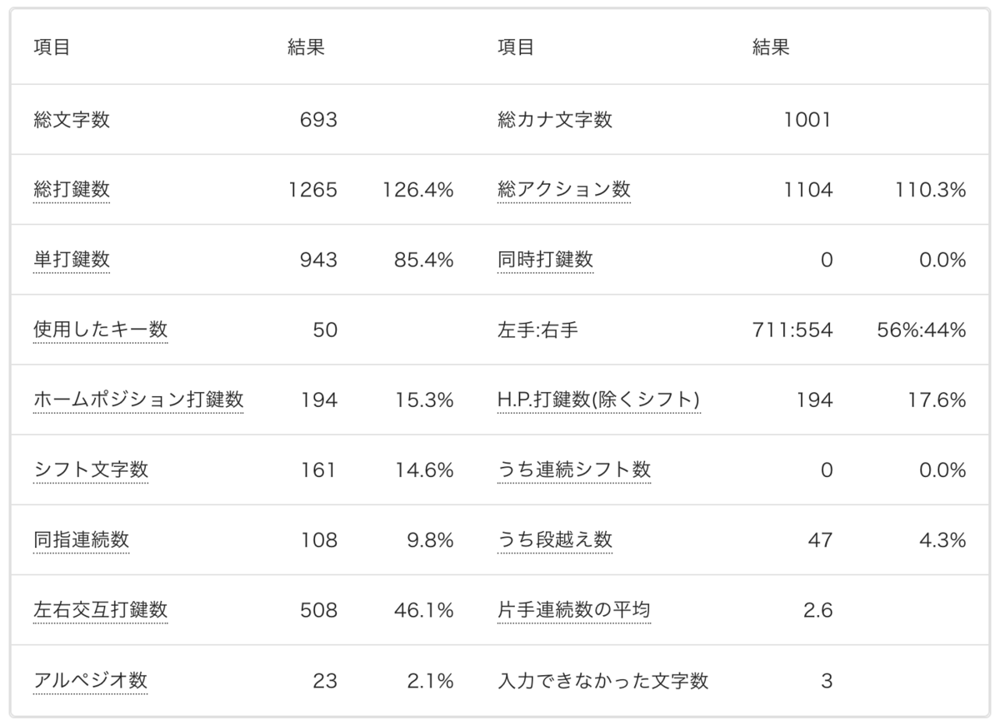

### JIS下駄

キー打鍵列:
```
:g<o>dj<k>fyf<shift>,:@5zi2h4;.xe<d>-j<k>w<shift>,pg:g<i>gj<shift>,fg:g<i>gjsuo<k>2<k>qexyk:g<i>gj:e<k>w3.<shift>.b@<d>@e<i>ajkth<k>q4<j>h<o>g<k>qethxe<d>-jkxe<d>-jd@toxyux;.q/<shift>,th<d>0mque<shift>.66zxf7h2ukm<k>w3l<shift>,pg:g<i>gj7fg:g<i>gjkxe<d>-j9lmaexe<shift>.pe<o>cj<o>cjqeka<i>ajif154y<shift>^404yb/4eh_<shift>lwe<k>s2h4;we.<shift>.:g<o>dj<k>fyf<shift>,ui<i>d.etk:@5z<k>z<d>9jbeyd<d>02hy<k>w6l<shift>,b;of:g<o>dj<k>fyk3.<3>2t<e>lj7bc/t<e>ljuei2h4;we.<shift>.<i>dg:@u<k>s<k>w:gtyuevxe<d>-j<k>t<o>dj<k>te<d>0j:.s<shift>,:g<o>dj<k>fyuekxe<d>-jbgth:e<k>t^ytr.s<k>sj<k>di<shift>,3oqixe<d>-j4h<o>cjixe<d>-jpg<u>aheydk<i>c9jqe<k>tf@<d>:yr.<shift>.b;<d>0:g<o>dj<k>fyktgpets9<k>2<shift>.b;oksjqy<l>fh<i>c9jqe7ckqkpg<u>aheydu<k>s<d>0tedw:g<o>dj<k>fyf:gtyuevipg<u>ahd<shift>,:g<o>dj<k>fy<k>sjd<k>t<k>z<d>9j<i>djdz<k>r<k>ha<d>02xe<k>w:gpy<d>0:eper.<shift>.b;<d>0ea<k>dd:@s9<k>2<shift>.ck<k>b<shift>,bbtoth<i>d<k>z<d>9jbeyd<k>t-j<i>d@x;.bsi9gw<shift>,:@5z<i>aji3.<e>2<k>2ly<k>t<k>z<d>9jbd<shift>,xoi:g<o>dj<k>fy7pg:g<i>gj<k>tso0;w<shift>,<o>gjbud:@py<k>ttyper.<shift>.b;<d>0i<k>dd:@s9<k>2<shift>.qe<k>te<k>wtq4gq:g<o>dj<k>fys<e>2<k>2ly69<k>vc;iso0;qpg:g<i>gjktq4l<k>ttycjdqmkf<g>ftx<k>2qs9<k>f;.<shift>.<j>h<k>z<d>9jb<f>rpy:emxy<o>djenterenter:eqef<shift>,vtgpe<o>cjqe<k>wf5y<k>fy<o>cjk:eqe<k>w3.<k>t<shift>,<i>dg:@u<k>s<k>w:gtyuevxe<d>-j<k>t<o>dj<k>te<d>0j:.stgpetd<shift>,<k>zch<j>h3.eftl3ds9<k>f;.3/[<k>f<o>cjksgz<d>0k<k>fdwqe<d>0dywyxp<shift>,xe<i>djwzif^y<s>^e<o>cj3.ef<i>gj<o>cji^ytr.<shift>.xoiuevxe<d>-j^k,y<u>ah<k>bif<shift>,:g<o>dj<k>fyue<k>2kt<e>lj<k>txe<d>-jbgthkpe<k>2ykvs@<k>w3.3hay<e>2o/ysi9gw<i>aj6jiq<k>hl9po;<shift>,/<k>q47zk9ju:eqesu.<shift>.<j>hb;ft<e>lju<k>skxe<d>-j<o>djzty<k>t<i>aj6j<k>2^s3@4.to<k>w3.<shift>.
```

ヒートマップ・グラフ等:

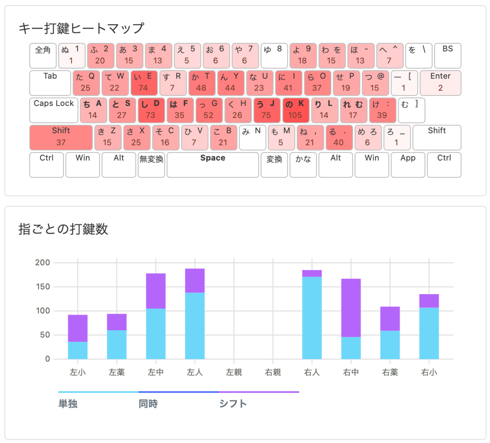

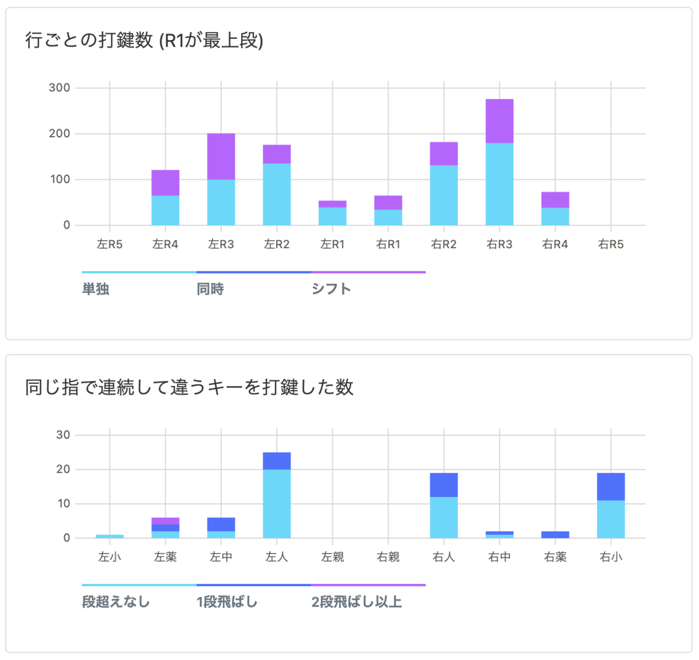

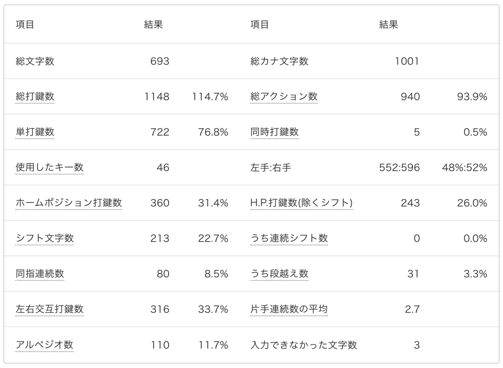

## ◆ 計測3の分析

今回、入力できなかった文字が3とカウントされているが、一部漢字かな変換がうまくいかなかった言葉がある様子。

今回気になった結果としては、「**同じ指で連続して違うキーを打鍵した数**」が、左人差し指が非常に多いという結果になっている。これはおそらく、「かっ」といった**特定の語が多かったことが影響**していると思われる。実は計測2でも右人差し指で同様の傾向が見られていて、この辺も打鍵の辛さとか好みに影響がありそうなファクターかもしれない。

あと今回「ふ」と「ほ」の出現頻度が高かったようで、それによって**最上段の利用頻度が他の計測よりも高くなっている**。個人的には計測2の分析でも述べたように「え/お/や」ほど打ちにくいと感じないのでさほど気にならないけれど、人によっては最上段の利用頻度が多いのは好ましくないのかもしれない。

ちなみに自分が最上段に慣れているのは、普段からプログラミング等で記号入力が多いこととかなり相関がある。また、自分は人よりも結構手が大きいので、こうした様々なコンテキストが、JISかななどの利用には影響があると思われる。

自分はこれらの要因によって、他の配列であるような各種シフトを使った同時押しをするくらいなら、手を伸ばして単打になっていた方が嬉しいなと思う方なのもあって、今回の[JIS下駄配列](https://github.com/funatsufumiya/jis_geta)の考案に至ったのだけれど、JISかなと同じように、キーボード全体を使う傾向にあることは今回のヒートマップの分析でも明らかになったように思う。

<div align="center">◆・◆・◆</div>
<div align="center">◆・◆・◆</div>

## まとめ

データ量が多い記事となったので、一応箇条書きで分析結果をまとめておく。

- JISかなに比べて、JIS下駄は最上段の利用頻度は下がっている。
- JISかなが中心部以外に偏りがたまに見られる一方、JIS下駄はより中心寄りになっている。
- Shiftと@の利用頻度が下がっている代わりに、K = 中指シフトの利用頻度が高い。
    - 今回句読点などにShiftを利用する設定をしたが、中指シフトを使う選択をした場合はより偏重傾向がある可能性。
- 打つ文章によっては、最上段の利用頻度が上がることがある。特に「え/お/や」などの打ちづらいキーもあるが、高頻度というほどではないものの、ここで好みが分かれる可能性。
- 偏りは解消されているが、設計思想の時点でそうであるように、キーボード全体を満遍なく使う傾向。
